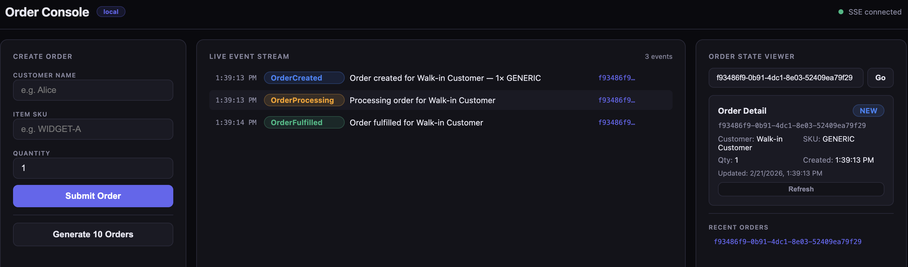
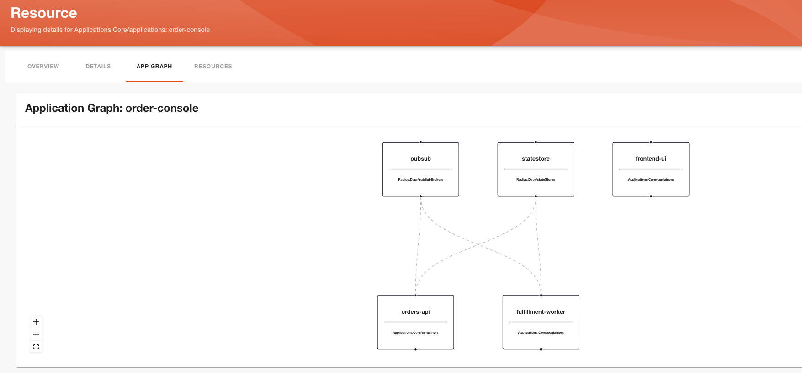

# Order Management Application with Dapr and Radius

This sample demonstrates a microservices order-processing application that uses [Dapr](https://dapr.io) for state management and pub/sub messaging, leveraging [Radius](https://radapp.io) for deployment across Kubernetes and Azure.

## Sample Overview

```
┌──────────────┐  POST /api/orders  ┌─────────────┐  Dapr publish  ┌───────┐
│   Next.js UI │ ─────────────────► │ orders-api  │ ─────────────► │ Kafka │
│              │  SSE /events/stream│ (port 3000) │  topic:orders  └───┬───┘
└──────────────┘ ◄───────────────── └──────┬──────┘                    │
                                           │ Dapr state                │ Dapr subscription
                                           ▼                           ▼
                                    ┌────────────┐            ┌────────────────────┐
                                    │ PostgreSQL │ ◄───────── │ fulfillment-worker │
                                    │(statestore)│  Dapr state│    (port 3002)     │
                                    └────────────┘            └────────────────────┘
```

This sample showcases how to deploy a containerized microservices application that connects to different infrastructure backends using Radius. The sample includes:

- Resource type definitions for Dapr components in `types.yaml`
- Terraform recipes for deploying infrastructure to Kubernetes and Azure
- `app.bicep` that defines the three services and connections to infrastructure

### Application UI



## How to deploy the sample?

### Pre-requisites

- A Kubernetes cluster to host Radius control plane and the application. 
- [Radius installed on your Kubernetes cluster](https://docs.radapp.io/tutorials/install-radius/) Note: Your user must have the Kubernetes cluster-admin role to install Radius and deploy the sample application.
- [Dapr installed on your Kubernetes cluster](https://docs.dapr.io/operations/hosting/kubernetes/kubernetes-deploy/)
- [Azure cloud provider configured in Radius](https://docs.radapp.io/guides/operations/providers/azure-provider/) (for Azure deployment only)

### 1. Create Dapr resource types

```bash
rad resource-type create -f radius/types.yaml
```

### 2. Bicep extension

> [!NOTE]
>
> No action is needed in this step.

Because we created new Resource Types, a Bicep extension needs to be created and referenced in `bicepconfig.json`. The Bicep extension has already been created as `radius/extensions/radiusdapr.tgz`.  And the `bicepconfig.json` has been created.

If you make changes to the `types.yaml`, run the following command to create a new archive and update the extension in Radius:

```bash
rad bicep publish-extension -f radius/types.yaml --target radius/extensions/radiusdapr.tgz
```

### 3. Use Published Recipes

> [!NOTE]
>
> No action is needed in this step.

Recipes are either Bicep templates or Terraform configurations. In this sample, we are using Terraform stored in this Git repository. Because we are using a public GitHub repository, no additional authentication is needed. If you stored the Terraform configurations in a private repository, you need to provide Radius with an [access token](https://docs.radapp.io/guides/recipes/terraform/howto-private-registry/). If you would like to learn to create and publish your own Recipes, read [this guide](https://docs.radapp.io/guides/recipes/howto-author-recipes/).

This sample uses the following Recipes:

**Kubernetes Recipes**

- `recipes/stateStores/kubernetes/main.tf` — PostgreSQL 16 deployed in-cluster with a Dapr `state.postgresql` component
- `recipes/pubSubBrokers/kubernetes/main.tf` — Apache Kafka (KRaft mode) deployed in-cluster with a Dapr `pubsub.kafka` component

**Azure Recipes**

- `recipes/stateStores/azure/main.tf` — Azure Database for PostgreSQL Flexible Server with a Dapr `state.postgresql` component
- `recipes/pubSubBrokers/azure/main.tf` — Azure Event Hubs (Kafka-enabled) with a Dapr `pubsub.kafka` component

### 4. Create a Radius Environment

This sample deploys containers onto a Kubernetes cluster. However, the Kafka queue and PostgreSQL database can either be deployed to the same Kubernetes cluster or to Azure. Create a Kubernetes or an Azure environment.

#### 4a. Kubernetes-only

If you want to deploy the sample application to your local Kubernetes cluster, follow the steps below to set up the Kubernetes environment and register the Kubernetes Recipes. If you have configured the Azure provider and want to deploy to Azure, skip to the next section.

Create a resource group and deploy the Kubernetes environment:

```bash
rad group create local
```

```bash
rad deploy radius/environments/kubernetes.bicep --group local
```

> [!NOTE]
>
> If you hit an error "No environment name or ID provided, pass in an environment name or ID" create an environment first with `rad environment create azure --group azure` and then run the deploy command again. This is a temporary workaround and should be fixed in v0.55.0 release.

This creates a `local` environment and registers the Kubernetes recipes.

Create a workspace. Workspaces define which Radius control plane, Radius resource group, and environment the CLI uses.

```bash
rad workspace create kubernetes local \
  --context $(kubectl config current-context) \
  --environment local \
  --group local
```

Confirm the environment was created:

```
$ rad environment list
RESOURCE   TYPE                            GROUP    STATE
local      Applications.Core/environments  local    Succeeded
```

You can view the Environment's detail using:

```bash
rad environment show local -o json
```

Confirm the Recipes were registered:

```
$ rad recipe list
RECIPE    TYPE                          TEMPLATE KIND  TEMPLATE
default   Radius.Dapr/stateStores       terraform      git::https://github.com/Reshrahim/order-console.git//radius/recipes/stateStores/kubernetes
default   Radius.Dapr/pubSubBrokers     terraform      git::https://github.com/Reshrahim/order-console.git//radius/recipes/pubSubBrokers/kubernetes
```

#### 4b. Kubernetes and Azure

> [!NOTE]
>
> Follow the instructions in the [Azure provider guide](https://docs.radapp.io/guides/operations/providers/azure-provider/) to set up your Azure environment and register your Azure credentials with Radius before proceeding with the steps below.

Create a resource group and deploy the Azure environment:

```bash
rad group create azure
```

Create an Azure resource group for the Kafka queue and PostgreSQL database:

```bash
az group create --name order-console2 --location <location>
```

Deploy the Azure environment, passing your Azure subscription and resource group:

```bash
rad deploy radius/environments/azure.bicep --group azure \
  -p azureSubscriptionId=$(az account show --query id -o tsv) \
  -p azureResourceGroup=order-console \
  -p location=$(az group show --name order-console --query location -o tsv)
```
> [!NOTE]
>
> If you hit an error "No environment name or ID provided, pass in an environment name or ID" create an environment first with `rad environment create azure --group azure` and then run the deploy command again. This is a temporary workaround and should be fixed in v0.55.0 release.

Create a workspace. Workspaces define which Radius control plane, Radius resource group, and environment the CLI uses.

```bash
rad workspace create kubernetes azure \
  --context $(kubectl config current-context) \
  --environment azure \
  --group azure
```

Confirm the environment was created:

```
$ rad environment list
RESOURCE   TYPE                            GROUP    STATE
azure      Applications.Core/environments  azure    Succeeded
```

You can view the Environment's detail using:

```bash
rad environment show azure -o json
```

Confirm the Recipes were registered:

```
$ rad recipe list
RECIPE    TYPE                          TEMPLATE KIND  TEMPLATE
default   Radius.Dapr/stateStores       terraform      git::https://github.com/Reshrahim/order-console.git//radius/recipes/stateStores/azure
default   Radius.Dapr/pubSubBrokers     terraform      git::https://github.com/Reshrahim/order-console.git//radius/recipes/pubSubBrokers/azure
```

### 5. Adjust Kubernetes permissions

By default, one of the Radius service accounts does not have sufficient permissions to read the Dapr CRDs on the cluster. A [bug on this](https://github.com/radius-project/radius/issues/11292) has been opened. Until that is resolved, manually adjust the permissions.

```bash
kubectl apply -f clusterrole-radius-dapr.yaml
```

### 6. Deploy the Order Management Application

Switch to the environment you want to deploy to:

```bash
rad environment switch <environment-name>
```

```bash
rad deploy radius/app.bicep
```

Deployment may take 15-20 minutes for Azure resources.

```bash
Deployment In Progress...

Completed            order-console   Applications.Core/applications
Completed            statestore      Radius.Dapr/stateStores
Completed            pubsub          Radius.Dapr/pubSubBrokers
Completed            frontend-ui     Applications.Core/containers
.                    fulfillment-worker Applications.Core/containers
.                    orders-api      Applications.Core/containers

Deployment Complete

Resources:
    order-console   Applications.Core/applications
    frontend-ui     Applications.Core/containers
    fulfillment-worker Applications.Core/containers
    orders-api      Applications.Core/containers
    pubsub          Radius.Dapr/pubSubBrokers
    statestore      Radius.Dapr/stateStores
```

Access the application using port forwarding. For the local environment:

```bash
kubectl port-forward svc/frontend-ui 3000:3000 -n local-order-console
```
For the Azure environment:

```bash
kubectl port-forward svc/frontend-ui 3000:3000 -n azure-order-console
```

Open **http://localhost:3000** in your browser.

### 7. Access the Radius dashboard

Port-forward the Radius dashboard:

```bash
kubectl port-forward --namespace=radius-system svc/dashboard 7007:80
```
Access the Application graph at [http://localhost:7007/resources/azure/Applications.Core/applications/order-console/application](http://localhost:7007/resources/azure/Applications.Core/applications/order-console/application)



### 7. Clean up

Delete the application:

```bash
rad app delete -a order-console
```

Delete the ClusterRoles and ClusterRoleBindings:

```bash
kubectl delete -f clusterrole-radius-dapr.yaml
```
